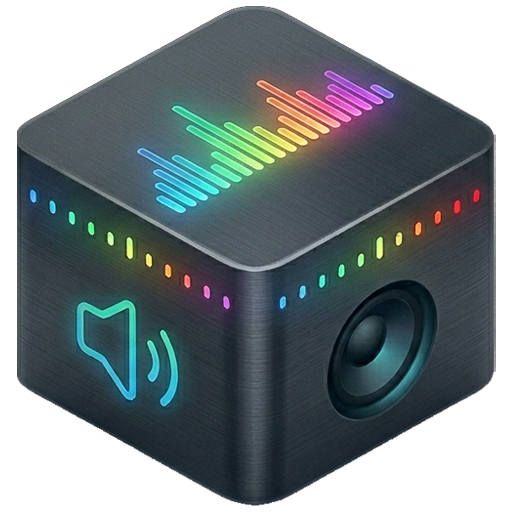

# Panon.Windows

Windows 任务栏音频频谱可视化器 —— 基于 [Panon](https://github.com/rbn42/panon) (KDE Plasma) 的 Windows 移植版。

在 Windows 10/11 任务栏上显示实时音频频谱动画，支持 7 种视觉效果。



---

## 支持平台

| Windows 版本           | 状态                                     |
| ---------------------- | ---------------------------------------- |
| Windows 11 (21H2~24H2) | ✅ 完整支持（主力开发平台）              |
| Windows 10 (1809~22H2) | ✅ 支持                                  |
| Windows 10 (1607~1803) | ⚠️ 理论可用（低于 WinAppSDK 最低要求） |
| Windows 7 / 8 / 8.1    | ❌ 不支持                                |

---

## 功能特性

- **实时音频频谱** — WASAPI Loopback 捕获系统音频输出
- **7 种视觉效果** — 柱状图 / 波浪 / 实心单声道 / 实心立体声 / 光束 / 频谱瀑布 / 连线
- **任务栏集成** — 频谱与任务栏重叠显示，支持"铺满任务栏"和"仅空白区域填充"两种模式
- **多显示器** — 支持主显示器、指定显示器或所有显示器
- **8 套预设配色** — 彩虹 / 霓虹 / 极光 / 日落 / 海洋 / 火焰 / 森林 / 紫罗兰 + 随机颜色
- **HSL / HSLuv 色彩空间** — 可精细调整色相、饱和度、亮度
- **系统托盘控制** — 右键菜单：设置 / 暂停 / 退出
- **开机自启** — 可选注册表 Run 启动
- **系统透明效果** — 一键开启/关闭 Windows 任务栏透明效果
- **平滑过渡** — 音乐停止后频谱平滑衰减回落，无突变

---

## 技术栈

| 组件       | 技术                                       |
| ---------- | ------------------------------------------ |
| 语言       | C# (.NET 8)                                |
| UI 框架    | WinUI 3 (Windows App SDK 2.2)              |
| 音频捕获   | NAudio (WASAPI Loopback)                   |
| FFT        | Cooley-Tukey 2048 点                       |
| 渲染       | 纯软件 DIB Section 像素缓冲区 (BGRA 32bpp) |
| 任务栏检测 | Win32 SHAppBarMessage + UI Automation      |
| 设置存储   | JSON (%APPDATA%/Panon/settings.json)       |

---

## 安装与运行

### 便携版（普通用户）

从 [Releases](https://github.com/DevilSmail/Panon.Windows/releases) 下载 `Panon.Windows_vX.X_portable.zip`，解压后双击 `Panon.Windows.exe` 即可运行。

> 需要安装 [.NET 8 运行时](https://dotnet.microsoft.com/download/dotnet/8.0)（桌面运行时，x64）+ [Windows App SDK 2.2](https://learn.microsoft.com/en-us/windows/apps/windows-app-sdk/downloads)。

**系统要求：**

- Windows 10 version 1809+ 或 Windows 11
- 无需管理员权限
- 约 80 MB 磁盘空间

---

### 开发编译（开发者）

**安装依赖：**

| 依赖                | 必需 | 下载                                             |
| ------------------- | ---- | ------------------------------------------------ |
| .NET 8 SDK          | ✅   | https://dotnet.microsoft.com/download/dotnet/8.0 |
| Windows App SDK 2.2 | ✅   | [下载](https://learn.microsoft.com/en-us/windows/apps/windows-app-sdk/downloads)（NuGet 还原自动引用，无需手动安装）|

**克隆并编译：**

```powershell
git clone https://github.com/DevilSmail/Panon.Windows.git
cd Panon.Windows
cd src\Panon.Windows
dotnet run --configuration Debug
```

**发布便携版：**

```powershell
cd src\Panon.Windows
dotnet publish --configuration Release -r win-x64 -o publish_portable
# 将 publish_portable\Panon.Windows_portable 目录打包为 zip 即可分发（约 80 MB）
```

**项目使用的 NuGet 包：**

| 包                               | 版本            | 用途                 |
| -------------------------------- | --------------- | -------------------- |
| Microsoft.WindowsAppSDK          | 2.2.0           | WinUI 3 运行时       |
| NAudio                           | 2.3.0           | WASAPI 音频捕获      |
| Microsoft.Windows.SDK.BuildTools | 10.0.28000.1839 | Windows SDK 构建支持 |

**编译时框架引用（非 NuGet）：**

| 框架                         | 用途                           |
| ---------------------------- | ------------------------------ |
| Microsoft.WindowsDesktop.App | UIAutomation（任务栏按钮探测） |

---

## 使用说明

### 系统托盘

| 操作         | 效果                           |
| ------------ | ------------------------------ |
| 左键单击图标 | 打开设置窗口                   |
| 右键单击图标 | 弹出菜单（设置 / 暂停 / 退出） |

### 设置项说明

| 分类    | 设置项       | 说明                             |
| ------- | ------------ | -------------------------------- |
| 音频    | 低频衰减     | 减少低频成分对频谱的影响         |
| 音频    | 低音分辨率   | FFT 频率范围控制，值越小范围越宽 |
| 显示    | 图形效果     | 7 种频谱动画风格                 |
| 显示    | 填充模式     | 铺满任务栏 / 仅空白区域（默认）  |
| 显示    | 反转频谱     | 安静时满柱，有声时缩短           |
| 显示    | 柱子宽度     | 单个柱子的像素宽度 (1~30)        |
| 显示    | 柱间间隙     | 相邻柱子的像素间隙 (0~20)        |
| 显示    | 频谱方向     | 靠任务栏边缘 (默认) / 靠远边 / 居中。方向由任务栏位置自动适配 |
| 显示    | 帧率         | 10~60 FPS，默认 30               |
| 颜色    | 色彩空间     | HSL / HSLuv                      |
| 颜色    | 色相范围     | -4000~4000                       |
| 颜色    | 饱和度       | 0~100                            |
| 颜色    | 亮度         | 0~100                            |
| 颜色    | 预设配色     | 8 套内置方案 + 随机颜色          |
| Windows | 覆盖模式     | 任务栏在上 / 频谱在上             |
| Windows | 目标显示器   | 主显示器 / 指定 / 所有           |
| Windows | 频谱窗口高度 | 0=自动（默认）/ 自定义像素高度    |
| Windows | 系统透明效果 | 开启 Windows 任务栏透明          |
| Windows | 开机自启     | 注册表 Run 启动项                |

---

## 配置文件

配置存储在 `%APPDATA%\Panon\settings.json`，支持手动编辑（需重启程序生效）。

---

## 调试

运行日志输出到 `%TEMP%\panon_debug.txt`。

崩溃日志输出到 `%TEMP%\panon_crash_*.txt`。

---

## 与 Linux 原版的差异

| 项目     | Linux 原版                  | Windows 移植版                               |
| -------- | --------------------------- | -------------------------------------------- |
| 渲染引擎 | OpenGL + GLSL               | 纯软件 CPU 渲染（直接写像素）                |
| 音频捕获 | PyAudio / PulseAudio        | NAudio WASAPI Loopback                       |
| 窗口系统 | KDE Plasmoid                | Win32 分层窗口 + WinUI 3                     |
| 着色器   | 原生 GLSL                   | CPU 模拟（已实现 7 种，原版共 12 种）        |
| 配置文件 | KConfig (~/.config/panonrc) | JSON (%APPDATA%/Panon/settings.json)         |

---

## 致谢

本项目基于 [rbn42/panon](https://github.com/rbn42/panon) 移植，感谢原作者及 KDE 社区的贡献。

原项目贡献者：rbn42, flying-sheep (Philipp A.), NullDev (Chris), Vistaus (Heimen Stoffels), yuannan 等。

---

## 许可证

[GNU General Public License v3.0](LICENSE)

Copyright (C) 2024-2026 Panon.Windows Contributors
原项目 Copyright (C) 2018-2024 rbn42 and Panon contributors
